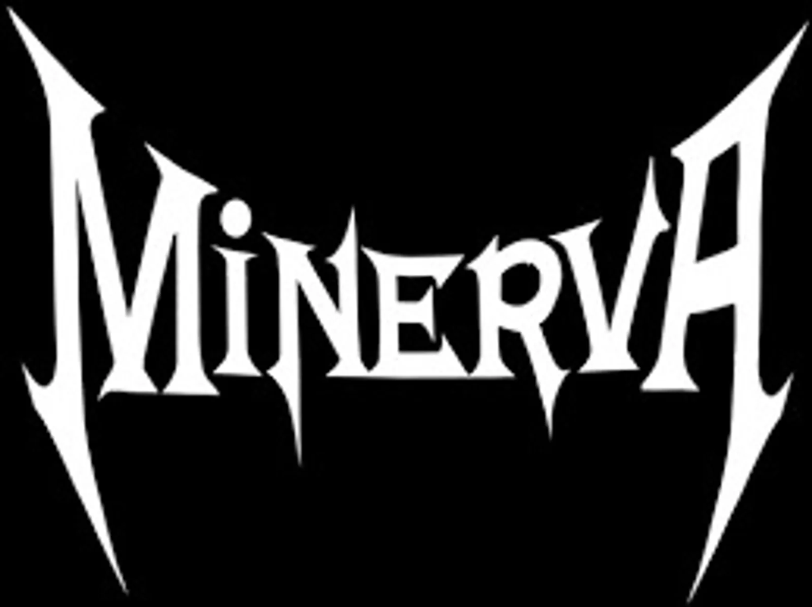

# 🎸 Minerva

[](https://github.com/GhostDog45/BD-Band-Music) [](#) [](#) [](#)

<p align="center">
  
</p>

## 🌟 About the Band

> **Minerva** is a prominent Bangladeshi heavy metal and alternative metal band formed in Dhaka in 2009. Recognized for crushing guitar riffs, dynamic groove structures, and soaring vocal aggression, Minerva established themselves as an influential powerhouse in modern Dhaka underground rock and metal. Their seminal single *"Odrishsho Grohoraaj"* stands as an enduring anthem in Bangladeshi heavy metal.

---

### 🎵 Tracklist (One-Tap Download)

- [**Minerva - Odrishsho Grohoraaj**](https://media.githubusercontent.com/media/GhostDog45/Minerva/master/07.%20Minerva%20-%20Odrishsho%20Grohoraaj%20%28music.com.bd%29.mp3?download=true) &nbsp; [](https://media.githubusercontent.com/media/GhostDog45/Minerva/master/07.%20Minerva%20-%20Odrishsho%20Grohoraaj%20%28music.com.bd%29.mp3?download=true)

---

### 💾 Git LFS & Downloading Audio
All audio tracks in this repository are managed via **Git LFS** (Large File Storage).
- **One-Tap Direct Download:** Click either the track title or the green `Download MP3` button next to any song to instantly save the file to your device.
- **To clone locally with all audio files:**
  ```bash
  git lfs install
  git clone https://github.com/GhostDog45/Minerva.git
  ```

---

### 🙏 Special Thanks & Gratitude
Heartfelt gratitude to **Shohail Ibne Mahbub (XTR)** for his monumental passion and dedication in keeping Bangladeshi band music alive. Through his archival project [**Bangla CD Covers**](https://banglacdcovers.blogspot.com/), he has painstakingly collected, preserved, and scanned original physical CDs and cassette tapes, ensuring that the legacy, artwork, and history of Bangladesh's rock and band movement remain preserved for generations of music lovers.
